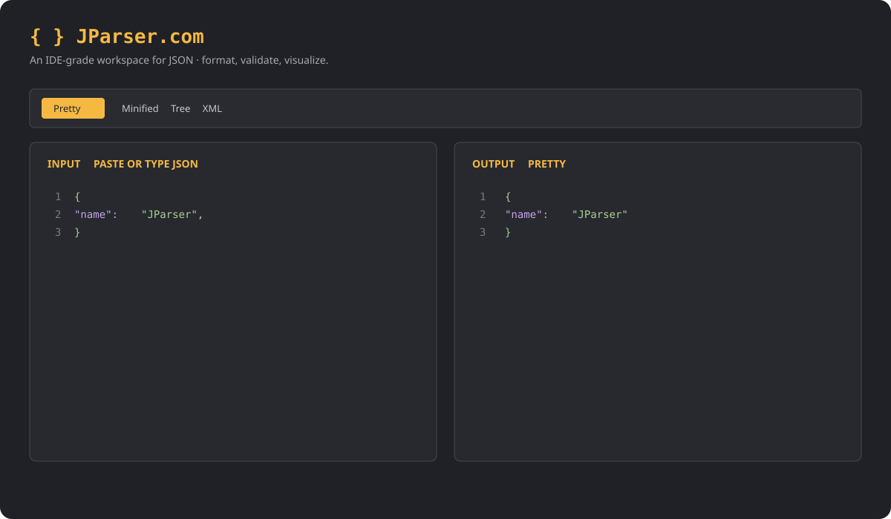
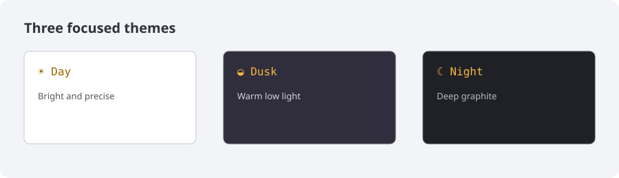

# JParser

JParser is a fast, private, IDE-style workspace for formatting, validating, and understanding JSON. It gives developers a clear place to paste a payload, inspect syntax-highlighted output, explore a collapsible tree, and export an XML representation without sending data to a server.

## Why this exists

Small developer utilities should be easy to trust and easy to use. JParser was built to remove friction from everyday debugging: instant client-side processing, readable errors, useful line numbers, and output that can be copied directly into the next tool or ticket. It is open source so the wider developer community can improve the experience, add formats, refine accessibility, and share ideas that benefit everyone.

## Features

- Pretty-print and minify JSON
- Live validation with line and column feedback
- Syntax-highlighted, line-numbered output
- Collapsible tree view for nested data
- JSON-to-XML view
- Day, dusk, and night themes
- Copy, sample, clear, whitespace, and size tools
- Client-side processing: your data stays in your browser

## Development

```sh
npm install
npm run dev
npm run build
```

The optional Go server in `../serve` serves the built `dist` directory on port 8087.

## Contributing

Issues, accessibility improvements, new format adapters, documentation, and thoughtful UI refinements are welcome. Please open an issue before substantial changes, keep processing private by default, and include clear reproduction steps or screenshots when reporting a problem.

## License

MIT License. Copyright © 2026 Elevity Holdings LLC. Principal Architect: Michael Bahlitzanakis. See [LICENSE](LICENSE).

## Screenshots





## Hosting

JParser is a static frontend and can be hosted on GitHub Pages, Netlify, Vercel, Cloudflare Pages, or any ordinary web server. Build it with `npm run build` and publish the generated `dist/` directory. For a self-contained server deployment, build the frontend and run the included Go server from `serve/cmd`:

```sh
cd repo
npm install
npm run build
cd ../serve
 go run ./cmd
```

The Go server serves the built assets on port `8087`. No database, runtime API, or environment variables are required.
